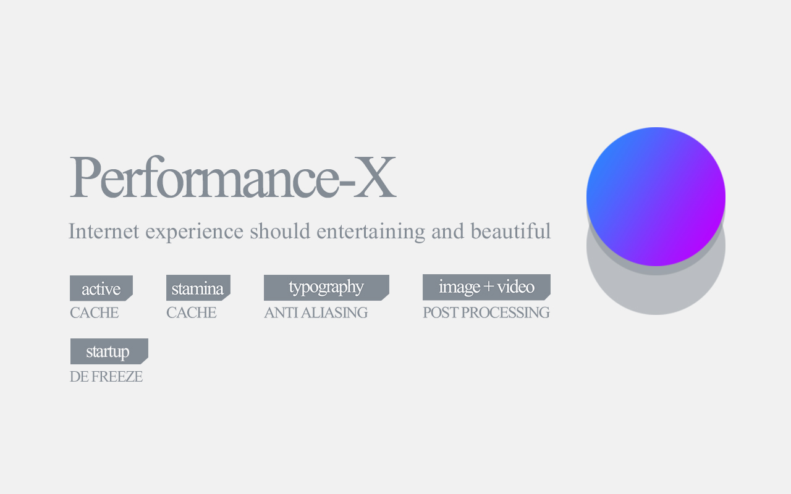

  

# Performance-X

> Chrome, Chrome OS, OPERA, EDGE, other Chrome-based web browsers

  

Accelerate page load, enhance image and video color, anti-aliased typography and more to come.

The internet should be entertaining and beautiful. `Performance-X` brings internet experience to the new level.

#### _features

- Anti-Aliasing Typography (font smoothing render).
- Color Enhancer (image and video post-processing).
- Active Caching (predictable page preload before you visiting).
- Stamina Caching (prolong cache duration).
- Slim Scrollbar (make web UI less noisy).

#### _todo

- Audio Enhancer

---

[MIT](https://github.com/loouislow81/performance-x-extension/blob/master/LICENSE)
